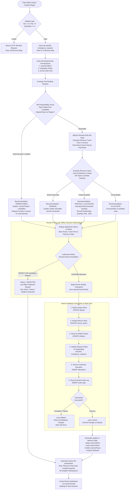

# Core Operational Workflow Diagram
**Project:** Disaster Management Resource Allocation System (Aruvi District)  
**Course:** 24GEP31 - Mini Project (Second Review), Department of CSE  

---

```mermaid
flowchart TD
    Start([Field Officer Enters Incident Report]) --> Validate{Validate Input<br/>Sev: 1-5, Pop > 0<br/>Quantities >= 0}
    
    Validate -- Invalid --> ErrResponse[Return HTTP 400 Bad Request<br/>Clear JSON Error Body]
    Validate -- Valid --> PersistNew[Insert into MySQL emergency_requests<br/>Store in In-Memory Map]
    
    PersistNew --> RankPQ[Insert into Deterministic PriorityQueue<br/>1. Severity DESC<br/>2. Population DESC<br/>3. Arrival Order ASC]
    
    RankPQ --> PickTop[Evaluate Top Pending Request]
    
    PickTop --> BFSCheck{BFS Reachability Check<br/>Open Roads from Candidate<br/>Depots/Teams to Region?}
    
    BFSCheck -- Road Severed / Isolated --> MarkUnreach[Recommendation: UNREACHABLE<br/>Explain: Closed Roads / Landslides<br/>Request remains in queue for road opening]
    
    BFSCheck -- Reachable --> DijkstraCalc[Dijkstra Shortest Path Min-Heap<br/>Calculate Minimum Travel Time in minutes<br/>Reconstruct Exact Hop-by-Hop Route]
    
    DijkstraCalc --> ResourceCheck{Evaluate Resource Stock<br/>Food & Medicine in Depot<br/>OR Teams & Shelter Capacity}
    
    ResourceCheck -- Stock Exhausted --> NoStock[Recommendation: PENDING<br/>Explain: Depot reachable but kits exhausted]
    ResourceCheck -- Partial Available --> PartialRec[Recommendation: PARTIALLY_ALLOCATED<br/>Calculate Recommended Quantity<br/>Record Outstanding Quantity: Req - Alloc]
    ResourceCheck -- Full Available --> FullRec[Recommendation: ALLOCATED<br/>Full quantities & available route]
    
    PartialRec --> PresentOfficer
    FullRec --> PresentOfficer
    MarkUnreach --> PresentOfficer
    NoStock --> PresentOfficer

    subgraph HumanDecision ["Human in the Loop: Officer Decision Authorization"]
        PresentOfficer[Display Algorithmic Advice in Modal<br/>Show Route, Travel Time & Resource Stats] --> OfficerChoice{Authorized Officer<br/>Reviews Recommendation}
        
        OfficerChoice -- REJECT with mandatory Reason --> OfficerReject[Status = REJECTED<br/>Log Officer Rejection Reason<br/>Zero Stock / Teams / Shelters Deducted]
        
        OfficerChoice -- CONFIRM Allocation --> AtomicTx[Begin Atomic MySQL Transaction<br/>conn.setAutoCommit false]
    end

    subgraph TransactionUpdate ["Atomic Database Transaction & State Sync"]
        AtomicTx --> Step1[1. Deduct Depot Stock<br/>UPDATE depots]
        Step1 --> Step2[2. Assign Rescue Team<br/>UPDATE rescue_teams]
        Step2 --> Step3[3. Reserve Shelter Places<br/>UPDATE shelters]
        Step3 --> Step4[4. Update Request Status & Outstanding<br/>UPDATE emergency_requests]
        Step4 --> Step5[5. Record Confirmed Allocation<br/>INSERT allocations]
        Step5 --> Step6[6. Record System Audit Log<br/>INSERT audit_logs]
        
        Step6 --> TxSuccess{Transaction<br/>Successful?}
        TxSuccess -- Exception / Failure --> Rollback[conn.rollback<br/>Revert all database changes<br/>Abort with Error]
        TxSuccess -- Success --> Commit[conn.commit<br/>Commit Changes to MySQL]
    end

    Commit --> SyncMemory[Atomically Update In-Memory State<br/>• depot.reserveStock<br/>• team.reserveTeam<br/>• shelter.reservePlaces<br/>• request.setStatus]
    
    SyncMemory --> RePrioritize[Automatic Queue Re-prioritization<br/>Rule: Remove & Re-insert mutated requests<br/>Re-heapify PriorityQueue]
    
    OfficerReject --> RePrioritize

    RePrioritize --> ReadyNext[Control Room Dashboard Live Synchronized<br/>Waiting for Next Decision]
```
